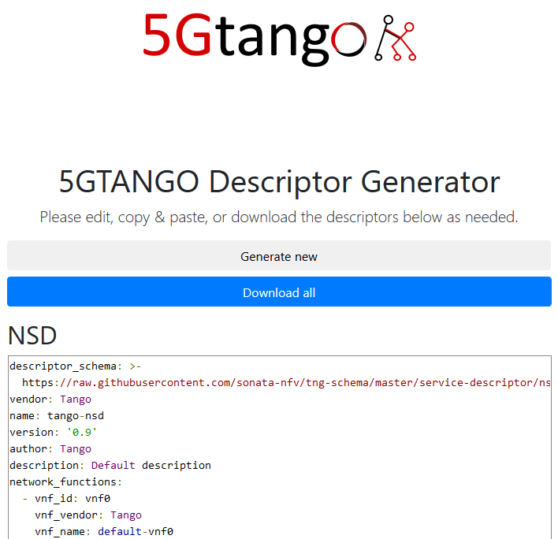

[](https://gitter.im/5gtango/tango-sdk)

<p align="center"></p>

# 5GTANGO Descriptor Generator
The descriptor generator provides a simple web-based GUI that allows to setup and generate correct descriptors (VNFDs and NSDs). The generator uses provided information or assumes default values if no information is provided. This allows the generation of descriptors with a single click.

The resulting VNFDs and NSDs can still be modified as needed.

## Installation and usage

Options:

* Download the repository and open `index.html` in a web browser to use it locally (tested with Firefox 58)
* Download the repository and deploy the Descriptor Generator as a Docker container (see below)
* Simply go to tango-sdk-sandbox.cs.upb.de (or soon sdk.5gtango.eu) to access the tool directly (running as Docker on a VM)


## Docker deployment

If you want to deploy the descriptor generator as a docker container, you can do so using the `Dockerfile`. The container will run a nginx webserver serving the descriptor generator. Simply download the repository and run from within:
* `sudo docker build -f Dockerfile -t tng-sdk-descriptorgen:latest .` to create the docker image
* `sudo docker images` to check that the image is there
* `sudo docker run -d -p 80:80 --name descriptorgen --rm tng-sdk-descriptorgen:latest` to start the docker container
* `sudo docker container ls` to check that the container is running
* Open localhost in your web browser to access the descriptor generation web interface
* `sudo docker stop descriptorgen` to stop the container

`DockerfilePipeline` is just used for the Jenkins pipeline.

## Tests

To test that everything is working correctly, you can use the provided unit tests in the `pipeline/unittest` directory. The tests use the [Protractor testing framework](http://www.protractortest.org/#/), which can be installed using

* `npm install -g protractor`
* `sudo webdriver-manager update`

Protractor needs Java, which can be installed using `sudo apt-get install default-jdk` on Ubuntu.
Once installed, the unit tests can be executed with (inside the `pipeline/unittest` directory):

```
protractor conf.js
```


This triggers the tests using Chrome in headless mode. If and only if all tests finish successfully, `protractor` exits with code 0.

## Workflow
### Input

The web interface asks for high-level information about the network service such as author and service name. For all fields, default values are provided to support the easy and fast generation of new descriptors. Clicking the "Generate" button triggers the generation of the descriptors.

The GUI also allows to upload already existing VNFDs that should be included in a network service. The descriptorgen then automatically generates the other VNFDs and integrates the existing VNFD in the NSD.
As a requirement, the uploaded VNFDs need the connection points input, output, and mgmt.
To integrate an uploaded VNFD in a network service, simply select it in the left drop-down menu. For such uploaded VNFDs, the image is already defined such that the specified image name and type in the GUI is ignored.


### Output

The generated descriptors are directly shown in code boxes that allow further manual adjustments and that provide yaml code highlighting. Once satisfied with the result, the descriptors can be downloaded individually or bundled together in a zip file.




## Development and contribution

Please check or create [issues](https://github.com/sonata-nfv/tng-sdk-descriptorgen/issues) matching the current and future development steps.

Contribution is very welcome! Please, fork the repository and create pull requests to submit implemented features. Make sure all unit tests pass before creating a pull request.
